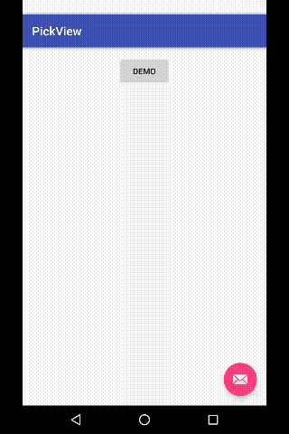

[](https://android-arsenal.com/details/1/2811)

# DEPRECATED

# PickView
This is a helper lib for us to pick date or province like IOS system 
WheelView widget.

Added feature to pick time with WheelView Widget

# Here is date pick effect by gif



## How to use

Add more custom attributes
    
   ```java
          
       SelctorPicker selctorPicker = new SelctorPicker.Builder(MainActivity.this, new SelctorPicker.OnItemSelector() {
                           @Override
                           public void onitemselector(String time) {
                               Toast.makeText(MainActivity.this, time, Toast.LENGTH_SHORT).show();
                           }
                       }).textConfirm("CONFIRM")
                               .textCancel("CANCEL")
                               .btnTextSize(16)
                               .viewTextSize(25)
                               .colorCancel(Color.parseColor("#999999"))
                               .colorConfirm(Color.parseColor("#009900"))
                               .setList(list)
                               .build();
                       selctorPicker.showPopWin(MainActivity.this);
      
   ```


## About LoopView 


 ```java
    
        <com.custompicker.pickerview.LoopView
            android:id="@+id/loop_view"
            android:layout_width="200dp"
            android:layout_height="180dp"
            android:layout_below="@+id/demo"
            app:canLoop="true"
            app:centerTextColor="#ff000000"
            app:drawItemCount="7" <!-- must be odd number -->
            app:initPosition="3"
            app:lineColor="@color/colorPrimary"
            app:textSize="25sp"
            app:topBottomTextColor="#ffafafaf"/>
            
            
         loopView = (LoopView) findViewById(R.id.loop_view);
                loopView.setInitPosition(2);
                loopView.setCanLoop(false);
                loopView.setLoopListener(new LoopScrollListener() {
                    @Override
                    public void onItemSelect(int item) {
                        
                    }
                });
                loopView.setTextSize(25);//must be called before setDateList
                loopView.setDataList(getList());    
 
 ```

# THANKS
 [PickView](https://github.com/brucetoo/PickView)


